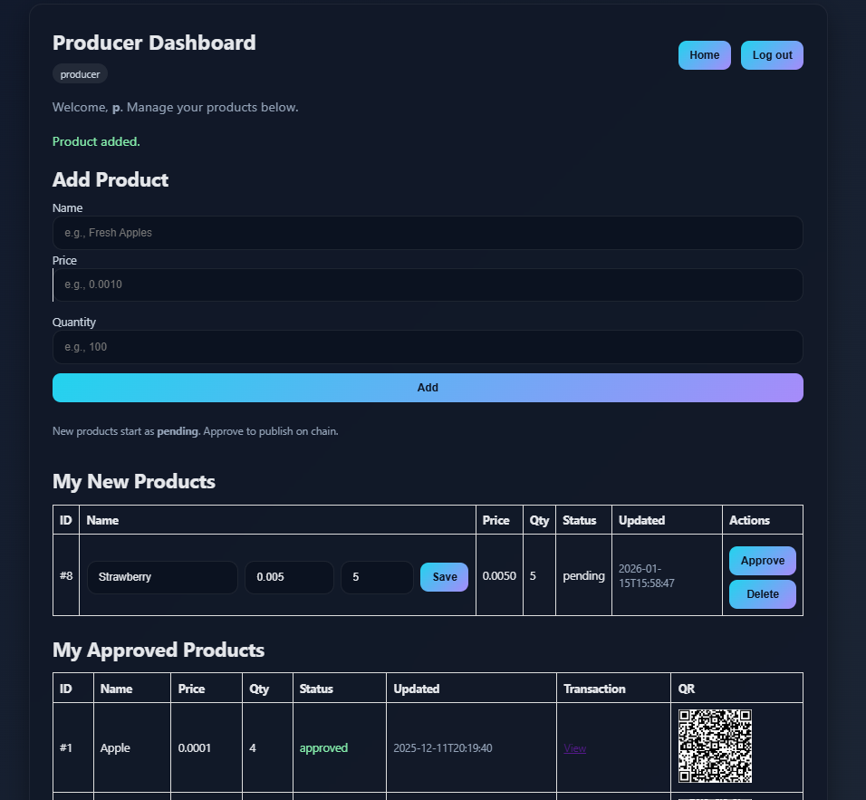
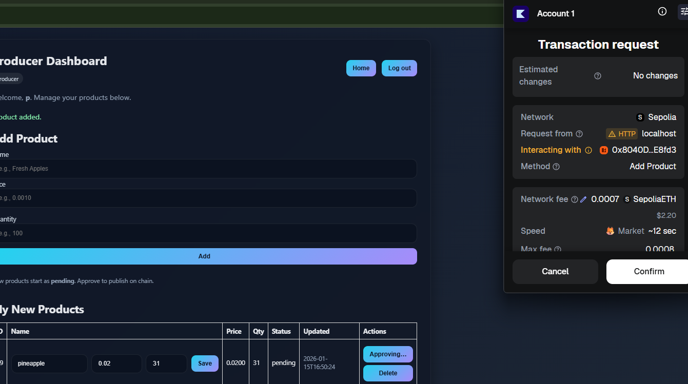
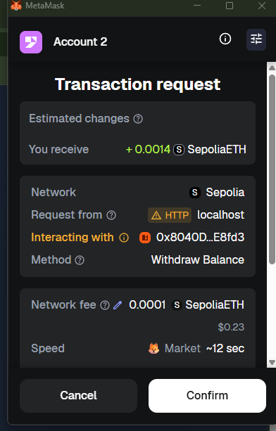
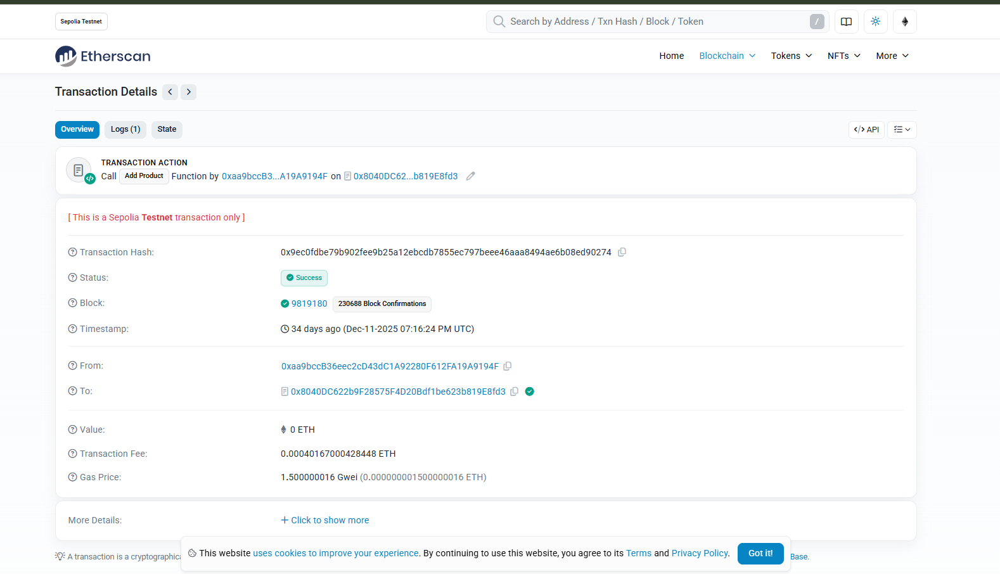
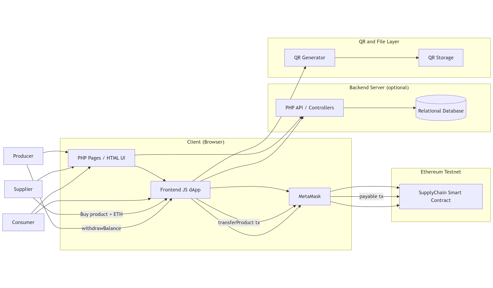
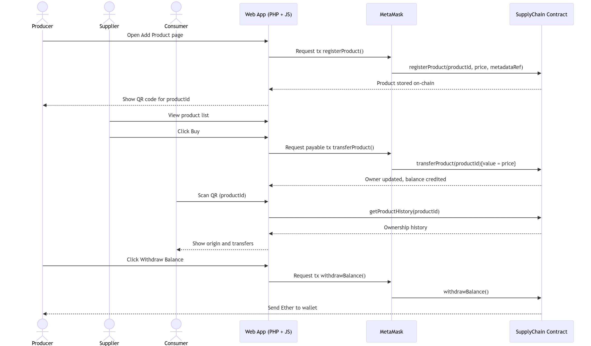

# Blockchain-Based Supply Chain Tracking System (BSTS)

A minimal **Ethereum dApp (Sepolia)** for supply-chain transparency with a **local PHP (XAMPP) web UI** and optional **QR-based public verification**.  
**Roles:** Producer registers products → Supplier buys quantities from producers → Consumer buys from suppliers.  
Payments accumulate into **on-chain internal balances** and can be **withdrawn** by the Producer/Supplier.

> Built as an educational project: the UI is intentionally lightweight and local state is stored in flat files for simplicity.

---

## Screenshots (Running Product)

### Producer — Add Product


### Producer — Approve / Publish + QR


### Supplier — Buy on-chain + Inventory + Balance


### MetaMask — Withdraw Balance (on-chain internal balance)


### Etherscan Proof — Transaction Details (Sepolia)


---
## Architecture

### System Overview


**Notes**
- Users interact through **PHP pages** that render the UI and load the **frontend JS dApp** logic.
- The JS dApp uses **MetaMask + ethers.js** to sign and send transactions to Sepolia.
- Local application state (demo users, rows, and UI convenience data) is stored in **text files**.
- The producer flow can generate **QR images** that can open a read-only product verification experience.

### Sequence Flow (End-to-End)


---
## Table of Contents
- Overview
- Features
- Tech Stack
- Repository Layout
- Quick Start
- Configure the Contract
- Run the App (XAMPP)
- Demo Script (Happy Path)
- QR Viewer (Optional)
- Troubleshooting
- Security & Limits
- Roadmap

---

## Overview

BSTS demonstrates end-to-end supply-chain flows:

- **Producer**
  - Adds products (name, unit price, quantity)
  - Approves/publishes products on-chain
  - Receives on-chain internal balance when suppliers purchase
  - Withdraws balance to wallet

- **Supplier**
  - Purchases available quantities from producers
  - Manages “supplied” inventory batches for consumer purchases
  - Receives on-chain internal balance when consumers purchase
  - Withdraws balance to wallet

- **Consumer**
  - Purchases quantity from supplier inventory
  - Can verify product info (optionally via QR viewer)

---

## Features
- **Role-based access control** enforced by the smart contract (Producer/Supplier/Consumer)
- **Quantity-aware payments** (unit price × quantity)
- **On-chain internal balances** with **withdrawal**
- **Flat-file local state** (`users.txt`, `products.txt`) for an extremely lightweight stack
- **Single shared contract config** (`contract-config.js`) used by both the PHP UI and the QR viewer
- Optional **QR codes** for read-only verification page

---

## Tech Stack
- **Solidity** smart contract on **Ethereum Sepolia**
- **MetaMask** for transaction signing
- **ethers.js (UMD)** used in the browser
- **PHP + Apache (XAMPP)** for the local web UI
- **Flat files** for local users/products storage

---

## Repository Layout

```text
SUPPLYCHAIN/
├─ contracts/
│  └─ ProductsChain.sol
├─ docs/
|  └─ ICS440 Project Progress Report.pdf
|  └─ ICS440 Project Final Report.pdf
│  └─ images/
└─ frontend/php/
   ├─ config.php
   ├─ contract-config.js
   ├─ contract.js
   ├─ dashboard_admin.php
   ├─ dashboard_producer.php
   ├─ dashboard_supplier.php
   ├─ dashboard_consumer.php
   ├─ dashboard.php
   ├─ login.php
   ├─ logout.php
   ├─ users.txt
   └─ products.txt
```

---

## Quick Start

1) Install **XAMPP** and start **Apache**.

2) Copy the project under XAMPP `htdocs`, for example:
- `C:\xampp\htdocs\ics440\`

3) Open:
- `http://localhost/ics440/login.php`

4) Log in as admin and create demo users:
- Default admin: `admin / admin123`
- Create:
  - `prod1` (producer)
  - `sup1` (supplier)
  - `cons1` (consumer)

5) Ensure each MetaMask account has **Sepolia ETH**.

---

## Configure the Contract

### 1) Deploy on Sepolia
Deploy `contracts/ProductsChain.sol` using Remix:
- Environment: **Injected Provider – MetaMask**
- Network: **Sepolia**

Copy:
- Deployed contract address
- Full ABI JSON

### 2) Set shared config (used by all pages)
Update:

```javascript
// frontend/php/contract-config.js
window.BSTS_CONFIG = {
  CONTRACT_ADDRESS: "0xYOUR_SEPOLIA_CONTRACT",
  ABI: [ /* paste FULL ABI JSON here */ ]
};
```

### 3) Assign roles (run once, using the deployer/admin account)
Call these contract methods (in Remix) for the addresses you will use in MetaMask:

```text
setRole(producerAddress, 1)  // Producer
setRole(supplierAddress, 2)  // Supplier
setRole(consumerAddress, 3)  // Consumer
```

### 4) Cache note
If you redeploy or change ABI/address:
- Hard refresh your browser (avoid stale JS config).

---

## Run the App (XAMPP)

- Start Apache in XAMPP.
- Visit: `http://localhost/ics440/login.php`
- Ensure MetaMask is set to **Sepolia**.
- The app stores local state in:
  - `frontend/php/users.txt`
  - `frontend/php/products.txt`

If you get write/permission issues, ensure Apache can write to those files (or run XAMPP as admin on Windows).

---

## Demo Script (Happy Path)

### Producer Flow
1) Log in as Producer (`prod1`).  
2) Add a product (example: `Apple`, `0.0001` ETH, qty `100`).  
3) Click **Approve** → MetaMask pops up → Confirm.  
4) Product becomes **approved** and appears in the approved list with:
   - **Transaction** link (Etherscan)
   - **QR** code for verification

### Supplier Flow
1) Log in as Supplier (`sup1`).  
2) Under **Available Products**, choose a product and enter quantity (≤ available).  
3) Click **Buy on chain** → confirm in MetaMask.  
4) Supplier inventory updates and the Producer’s internal on-chain balance increases.

### Consumer Flow
1) Log in as Consumer (`cons1`).  
2) Choose a supplier batch / inventory item.  
3) Enter quantity → **Buy on chain** → confirm in MetaMask.  
4) Supplier’s internal on-chain balance increases.

### Withdraw (Producer or Supplier)
The UI shows the **on-chain balance**, then you can withdraw it via MetaMask confirmation.

If you also expose helper calls in `contract.js`, the intended flow is:

```javascript
await getMyOnChainBalance(); // returns address + balance
await withdrawMyBalance();   // sends tx, returns tx hash
```

---

## Troubleshooting

**MetaMask connects but calls fail**
- Confirm network is **Sepolia** and `CONTRACT_ADDRESS` matches your deployed contract.

**“not producer / supplier / consumer”**
- Role is not assigned for the MetaMask address you’re currently using.

**“no matching fragment”**
- ABI mismatch (wrong ABI or wrong address). Re-copy ABI/address from Remix deployment.

**Etherscan link opens but looks wrong**
- Ensure it’s **Sepolia** Etherscan and the tx hash is for Sepolia.

**Local rows look inconsistent after redeploy**
- Flat-file state can desync from chain. Clear `products.txt` and redo the demo with the new contract address.

**Insufficient funds**
- The wallet needs Sepolia ETH for gas (and for payable functions where value is sent).

---

## Security & Limits
- Educational demo; not production hardened.
- Flat-file storage is not suitable for real deployments.
- No contract upgrade proxy; redeploy required for changes.
- Do not store private keys server-side.

---

## Roadmap
- Persist **on-chain product ID** alongside local file rows to remove mapping ambiguity
- Index contract events for a verifiable history/audit trail view
- Add UI polish: loaders, toast notifications, disabled states during tx mining
- Add a dedicated **Withdraw** button + balance refresh UX for Producer/Supplier
- Optional IPFS metadata for richer product details
- Add automated tests (contract + UI integration)

---
